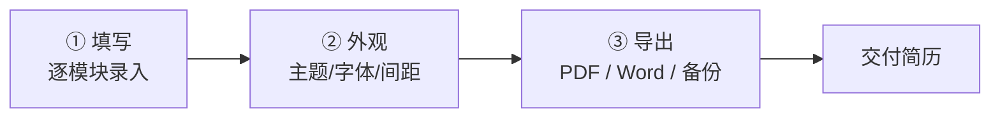

<p align="center">
  
</p>

<h1 align="center">简历编辑器 · Resume Editor</h1>

<p align="center">
  一款开箱即用的中文简历制作工具：引导式三步完成、所见即所得实时预览、6 种格式导出、37+ 套主题与行业模板，并内置 ATS 兼容检查与简历评分。
</p>

<p align="center">
  
  
  
  
  
</p>

---

## 目录

- [为什么是它](#为什么是它)
- [核心特性](#核心特性)
- [三步完成一份简历](#三步完成一份简历)
- [功能详解](#功能详解)
  - [简历模块](#简历模块)
  - [导出格式](#导出格式)
  - [外观定制](#外观定制)
  - [模板库](#模板库)
  - [智能能力](#智能能力)
- [快速开始](#快速开始)
- [快捷键](#快捷键)
- [技术栈](#技术栈)
- [部署](#部署)
- [许可证](#许可证)

---

## 为什么是它

做简历最麻烦的三件事——**排版不好看、导出格式乱、不知道写得好不好**。这个编辑器把这三件事都解决了：

- 不用懂设计，套一套模板、选一选主题就能出专业排版；
- 导出 PDF 是**矢量文字**（放大不模糊），PNG 是高清图，Word/HTML/Markdown 一个不落；
- 内置 ATS 兼容检查与 5 维评分，提交前先给自己把把关。

所有数据默认**仅保存在你本机浏览器**（localStorage），随写随存，刷新不丢。

---

## 核心特性

| 特性 | 说明 |
| --- | --- |
| 引导式三步 | 填写 → 排版美化 → 导出/备份，分阶段向导降低上手门槛 |
| 所见即所得 | 左编辑、中画布实时预览，增删改即时可见 |
| 7 类模块 | 个人信息 / 教育 / 工作 / 项目 / 技能 / 个人优势 / 自定义，可增删、显隐、拖拽排序 |
| 6 种导出 | PDF（矢量）、PNG（高清）、HTML、Word、Markdown、JSON 备份 |
| 37+ 主题 | 含中国传统色系列，支持自定义取色与自动衍生色阶 |
| 行业模板库 | 互联网 / 设计 / 产品运营 / 职能等 70+ 套示例模板一键套用 |
| 智能能力 | 可接入 AI 对话优化、ATS 兼容解析检查、本地简历评分 |
| 自动保存 | 本地持久化 + 多版本简历 + 50 步撤销重做 |

---

## 三步完成一份简历



- **阶段一 · 填写**：环形进度图、各模块完成度徽标，点击即可跳转补填。
- **阶段二 · 外观**：切换主题色、字体、标题样式、字号行高、页边距、模块间距。
- **阶段三 · 导出**：选择格式导出，设置四周边距（4/8/12/16mm 快捷预设），保存快照与多版本。

---

## 功能详解

### 简历模块

支持 7 类模块，均可任意增删、显隐标题、拖拽调序：

- **个人信息**：姓名、职位、电话、邮箱、所在地、链接、简介；字段可自定义增删、排序、改图标。
- **教育经历 / 工作经历 / 项目经历**：标准时间线结构，条目可复制、上下移、撤销恢复。
- **专业技能**：支持「类别+内容」或「名称+等级进度条」两种形态。
- **个人优势**：标题 + 内容，导出与其他模块字体/颜色统一。
- **自定义模块**：任意标题与内容，如「荣誉奖项」「其他作品」。

### 导出格式

| 格式 | 说明 |
| --- | --- |
| PDF（矢量） | 浏览器原生打印，文字为矢量，放大不模糊，适合投递 |
| PNG（高清） | 离屏渲染，约 300DPI，适合发图片、贴社交平台 |
| HTML | 自包含单文件，内嵌样式，方便二次托管 |
| Word（.docx） | 标准文档，可继续编辑 |
| Markdown | 纯文本，便于粘贴到支持 MD 的平台 |
| JSON 备份 | 全量数据导出，可再导入，跨设备迁移 |

所有格式统一受**四边距**设置控制（之前 PDF 边距写死在 CSS，现已改为可动态配置的上/右/下/左独立边距）。

### 外观定制

由 `ResumeConfig` 集中管理，实时预览：

- **主题色**：37+ 套预设（含国色系列），自定义取色器，自动衍生 50–700 色阶。
- **字体族**：16 款（苹方 / 微软雅黑 / 思源黑体 / 宋体 / Arial / Georgia 等），带字体测试对比弹窗。
- **排版**：字号 10–20px、行高 1.2–2.0，均带滑块与快捷预设。
- **标题样式**：22 种（下划线 / 侧边条 / 标签 / 中线 / 圆点 / 渐变系等）。
- **页面边距**：四边独立（mm），4/8/12/16mm 快捷预设 + 四边统一按钮。
- **间距**：模块间距、条目间距、下划线宽度独立可调。
- 一键「恢复默认外观」。

### 模板库

- **内置行业模板**：按分类（互联网技术 / 设计创意 / 产品运营 / 职能支持 / 通用等）提供 70+ 套完整示例模板，含主题色与示例内容，一键套用。
- **模板市场 UI**：搜索 + 分类筛选 + 缩略图预览 + 套用 / 另存为模板。
- **多版本简历**：针对不同岗位保存多份版本，快速切换。

### 智能能力

- **AI 优化**（可接入外部大模型）：支持 DeepSeek / OpenAI / Claude / 自定义端点，右侧对话式优化简历。
- **ATS 兼容性检查**：模拟招聘系统解析，给出兼容性评分与改进项。
- **简历评分系统**：本地启发式评分引擎（完整性 / 专业性 / 量化 / 关键词 / 格式 5 维度，等级 S/A/B/C/D），离线可用。
- **智能粘贴**：自动将编号 / 项目符号纯文本转为结构化列表。
- **富文本编辑**：加粗 / 斜体 / 下划线 / 删除线，支持 `Ctrl+B/I/U`。

---

## 快速开始

环境要求：Node.js 18+（建议 20+）。

```bash
# 克隆仓库
git clone <your-repo-url>
cd resume-editor

# 安装依赖
npm install

# 启动开发服务器（默认 http://localhost:5173）
npm run dev

# 构建生产版本（产物在 dist/）
npm run build

# 本地预览构建产物
npm run preview
```

> 数据默认保存在浏览器 localStorage（key：`resume-editor-data`）。换设备前请使用「导出 → JSON 备份」进行迁移。

---

## 快捷键

| 快捷键 | 功能 |
| --- | --- |
| `Ctrl/Cmd + Z` / `Ctrl/Cmd + Y` | 撤销 / 重做 |
| `Ctrl/Cmd + S` | 手动保存 |
| `Ctrl/Cmd + P` | 导出 / 预览 PDF |
| `Ctrl + B / I / U` | 加粗 / 斜体 / 下划线 |
| `Ctrl + D` | 复制当前条目 |
| `Ctrl + Enter` | 新增条目 |
| `Esc` | 取消选中 |
| `?` | 打开快捷键帮助 |

---

## 技术栈

- **框架**：Vue 3（`<script setup>` SFC）+ TypeScript
- **构建**：Vite 8
- **状态管理**：Pinia + pinia-plugin-persistedstate（本地持久化）
- **样式**：Tailwind CSS v4 + CSS 变量主题系统
- **交互**：vuedraggable（拖拽排序）、reka-ui（组件原语）、lucide-vue-next（图标）
- **导出依赖**：html2canvas（PNG）、docx（Word）、file-saver（下载）
- **关键模块**：
  - 状态与数据模型：`src/stores/resume.ts`、`src/types/index.ts`
  - 导出：`src/utils/exportFormats.ts`（HTML/Word/Markdown）、`src/utils/previewPdf.ts`（PDF/PNG）
  - 模板库：`src/templates/industryTemplates.ts`
  - 智能能力：`src/utils/ai.ts`、`src/utils/resumeScorer.ts`、`src/components/AtsChecker.vue`

---

## 部署

这是一个纯前端静态应用，构建后即可托管到任意静态平台。

### Vercel / Netlify

1. 导入仓库，构建命令设为 `npm run build`，发布目录设为 `dist`。
2. 无需额外服务端配置（所有逻辑在浏览器端运行）。

### GitHub Pages

```bash
npm run build
# 将 dist/ 内容推送到 gh-pages 分支或仓库 Pages 目录
```

> 提示：若部署在子路径下，请在 `vite.config.ts` 中配置 `base`。

---

## 许可证

当前仓库**未包含 LICENSE 文件**。若计划开源分享，请补充合适的许可证（如 MIT）后再对外分发。

---

<p align="center">
  用一份好简历，打开下一扇门。
</p>
